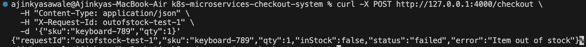
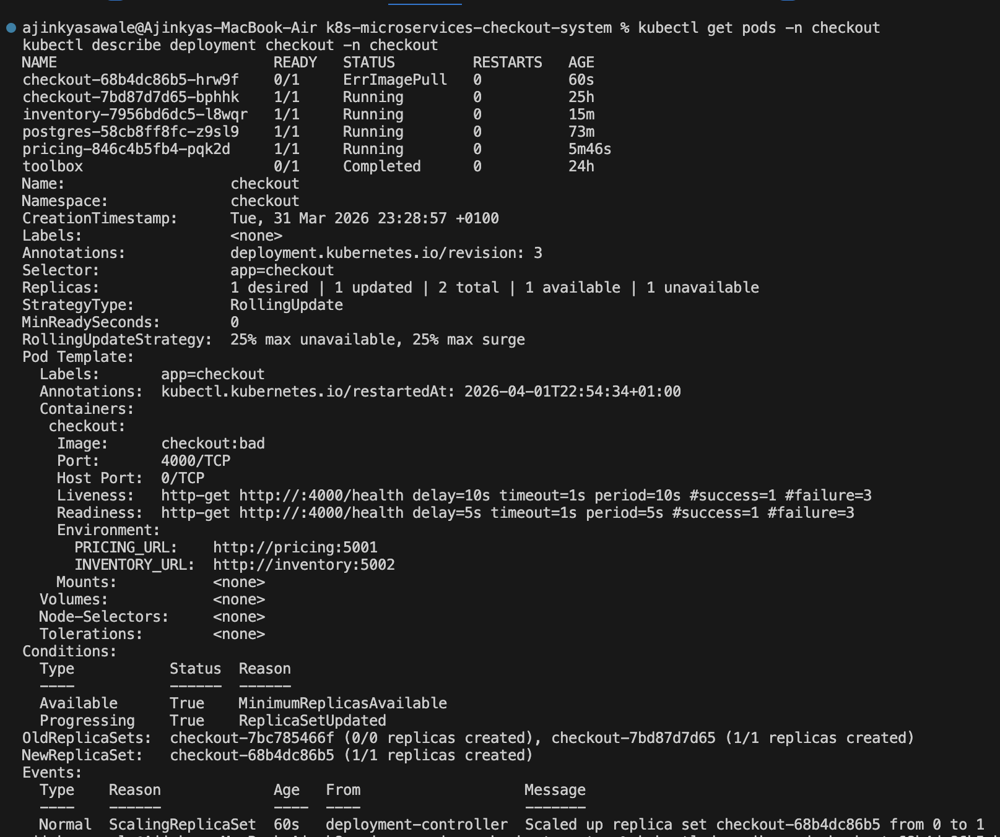
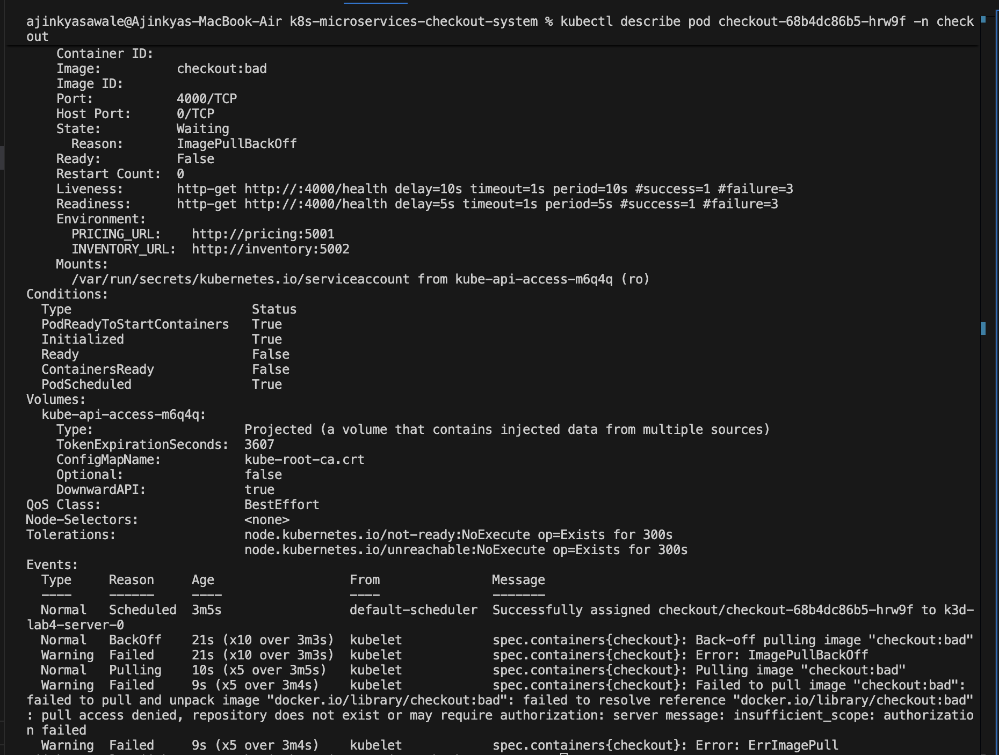
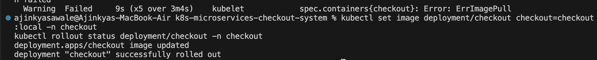

# k8s microservices checkout system

A cloud native microservices based checkout system built using Node.js and deployed on Kubernetes (K3s). This project demonstrates service communication, request tracing, scaling using KEDA, failure handling, and persistence using PostgreSQL.

---

## Overview

This project simulates an e commerce checkout workflow using multiple services:

- Gateway (entry point)  
- Checkout (business logic)  
- Pricing (price lookup)  
- Inventory (stock validation)  
- PostgreSQL (data persistence)  

The system is deployed on Kubernetes and exposed using Ingress (Traefik). It is designed to handle failures properly, scale dynamically, and provide clear debugging evidence.

---

## Architecture

**Request flow:**

Client → Ingress → Gateway → Checkout → Pricing + Inventory  

- Gateway handles incoming requests  
- Checkout coordinates pricing and inventory services  
- Services communicate internally using ClusterIP  
- Ingress exposes the system externally  

---

## Key Features

### Microservices Architecture

- Separate services for gateway, checkout, pricing, and inventory  
- Loose coupling using HTTP communication  
- Clear separation of responsibilities  

---

### API Endpoints

**Gateway exposes:**

- GET /  
- GET /api/ping  
- GET /api/arch  
- POST /api/checkout  

**Checkout internally calls:**

- pricing service  
- inventory service  

---

### Request Tracing

- Each request includes X Request Id  
- ID is propagated across all services  
- Logs include request ID for tracing  

---

### Scaling with KEDA

- Gateway configured for scale to zero  
- Automatically scales when traffic arrives  
- Scales down when idle  

**Cold start latency:**

**Warm request latency:**

---

### Failure Handling

- Checkout service uses timeouts for dependencies  
- Failures return clear error messages  
- Gateway remains available during failures  

**Partial failure example:**

---

## Testing and Reliability

### Out of Stock Scenario

System correctly handles unavailable stock.

---

### Bad Rollout Simulation

Invalid image causes deployment failure.

---

### Pod Level Error Diagnosis

Shows ImagePullBackOff and root cause.

---

### Recovery After Failure

System restored successfully after fixing deployment.

---

## Kubernetes Deployment

- Deployed using K3d (K3s)  
- Each service has Deployment and Service  
- Ingress used for external access  
- ClusterIP used for internal communication  
- Readiness and liveness probes configured  

---

## Security

- PostgreSQL credentials stored using Kubernetes Secrets  
- Application containers run as non root users  
- Privilege escalation disabled  
- Linux capabilities dropped  

---

## Observability

- Each service provides a health endpoint  
- Logs include request method, path, and request ID  

**Kubernetes debugging tools used:**

- kubectl logs  
- kubectl describe  
- kubectl get events  
- endpoints  

---

## Persistence (PostgreSQL)

- PostgreSQL deployed on Kubernetes  
- Uses Persistent Volume Claim for storage  
- Credentials managed using Secret  
- Data persists after pod restart  

---

## Tech Stack

- Node.js (Express)  
- Kubernetes (K3s / K3d)  
- KEDA  
- PostgreSQL  
- Docker  

---

## Project Structure
app/
gateway/
checkout/
pricing/
inventory/

k8s/
deployments
services
ingress
scaling
postgres

docs/
screenshots

---

## What This Project Demonstrates

- Microservices design on Kubernetes  
- Service to service communication  
- Request tracing using headers  
- Handling failures in distributed systems  
- Scaling applications using KEDA  
- Debugging using Kubernetes tools  
- Persistence using PostgreSQL  

---

## Future Improvements

- Add monitoring (Prometheus, Grafana)  
- Add centralized logging  
- Improve database schema  
- Add authentication  

---

## Author

Ajinkya Sawale