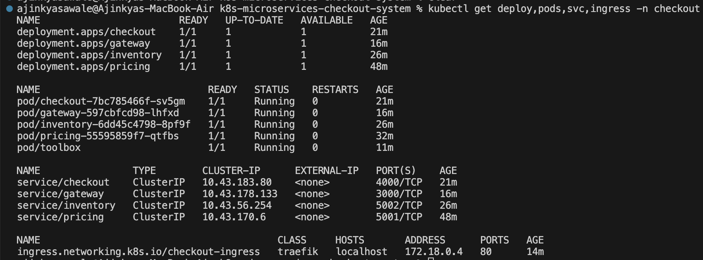
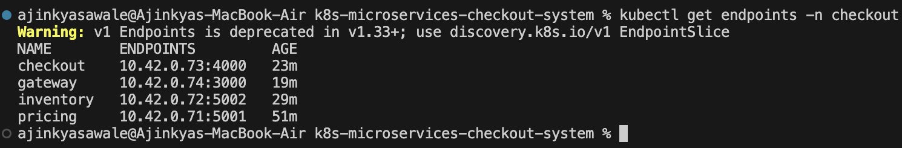
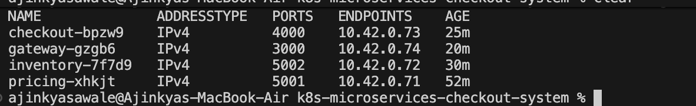
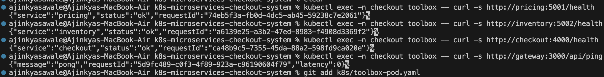
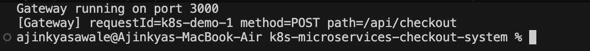
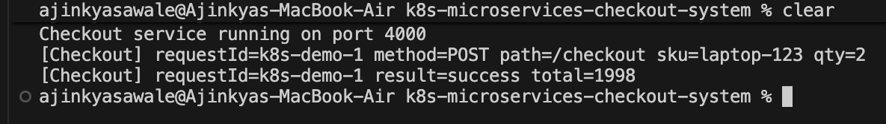
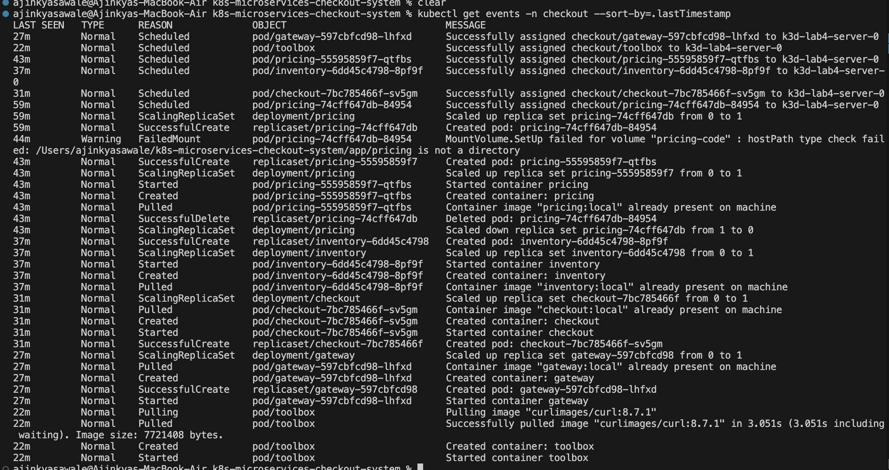

# k8s-microservices-checkout-system

This project is a microservices based checkout system built using Node.js and deployed on Kubernetes (K3d). The goal of this project is to understand how services communicate with each other and how Kubernetes helps in managing deployments, scaling, and reliability.

## Project Overview

This project simulates a simple e-commerce checkout system. It consists of multiple services like gateway, checkout, pricing, and inventory. Initially the services were tested locally and later deployed on Kubernetes.

## Current Architecture

Gateway service acts as the entry point
Checkout service handles business logic
Pricing service returns product price
Inventory service checks stock
Ingress is used to expose the gateway
All services communicate internally using ClusterIP

Planned features:
KEDA for scaling
PostgreSQL for persistence

## Implemented So Far

Gateway Service

Handles all incoming requests and routes them to checkout service
Endpoints available:
GET /
GET /api/ping
GET /api/arch
POST /api/checkout

It also generates and forwards X-Request-Id for tracing

Checkout Service

Handles checkout requests
Calls pricing and inventory services
Includes request ID propagation, timeout handling, and logging

Pricing Service

Returns price for a given product
Has /price and /health endpoints

Inventory Service

Checks if product is in stock
Has /stock and /health endpoints

## Kubernetes Implementation

All services are deployed on Kubernetes using K3d

Each service has its own deployment and service
ClusterIP is used for internal communication
Ingress is configured to expose the gateway
Docker images are built and used in the cluster

## Request Flow

Client -> Ingress -> Gateway -> Checkout -> Pricing + Inventory

Each request carries a unique request ID which helps in tracking across services

## Kubernetes Evidence

All Resources

Endpoints

EndpointSlices

Internal Connectivity

Gateway Logs

Checkout Logs

Events

## Project Structure

app/
gateway/
checkout/
pricing/
inventory/

k8s/
deployment and service files

docs/
screenshots

## Current Status

All services are working
Kubernetes deployment is completed
Ingress routing is working
Internal communication between services is verified
Screenshots and evidence are added

Pending work:
KEDA scaling
PostgreSQL integration

## Author

Ajinkya Sawale

