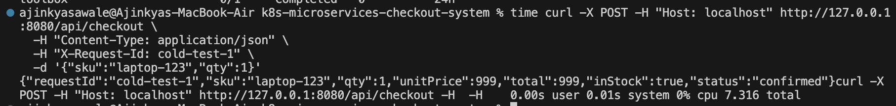
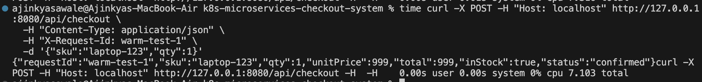
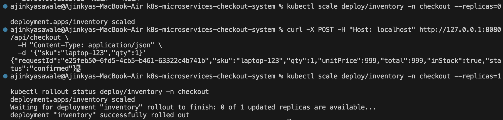
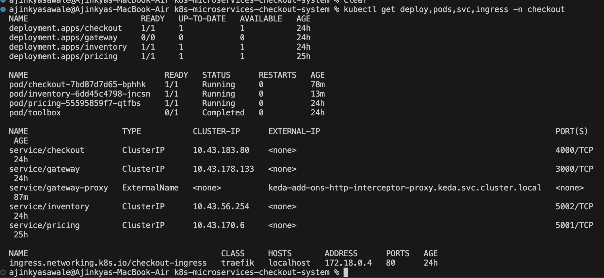
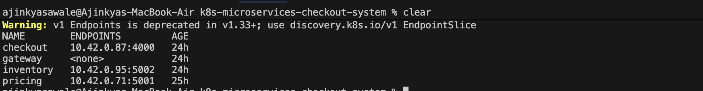
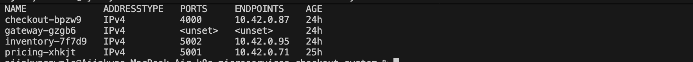
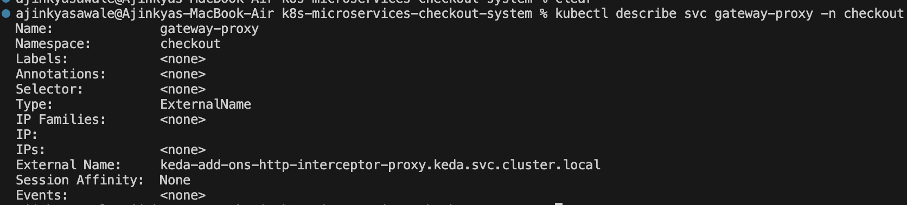
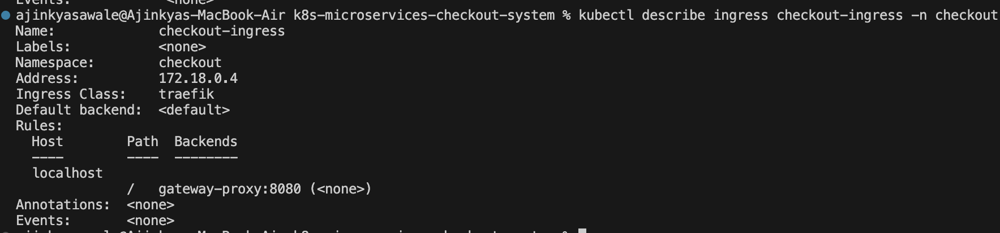
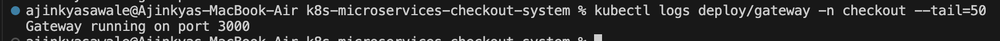
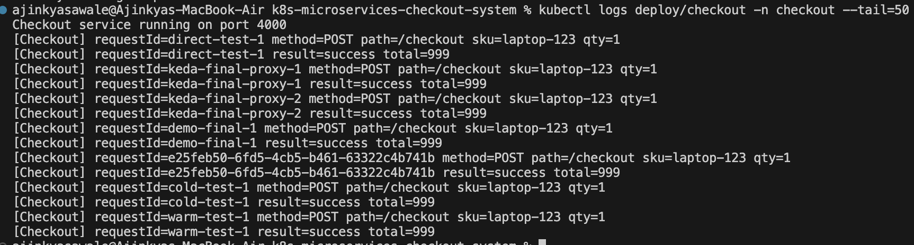

# k8s-microservices-checkout-system

This project is a microservices-based checkout system built using Node.js and deployed on Kubernetes (K3s/K3d). The aim of this project is to demonstrate service communication, request tracing, scaling, and troubleshooting in a Kubernetes environment.

---

## Project Overview

The system simulates a simple e-commerce checkout workflow using multiple services:

- Gateway (entry point)
- Checkout (business logic)
- Pricing (price lookup)
- Inventory (stock validation)

The application is exposed using Kubernetes Ingress and supports request tracing using X-Request-Id.

---

## Architecture

Request flow:

Client → Ingress → Gateway → Checkout → Pricing + Inventory

- Gateway handles all incoming requests
- Checkout communicates with downstream services
- Services communicate internally using ClusterIP
- Ingress exposes the application externally

---

## Services

### Gateway Service

- Acts as entry point
- Routes requests to checkout
- Generates and forwards X-Request-Id

Endpoints:
- GET /
- GET /api/ping
- GET /api/arch
- POST /api/checkout

---

### Checkout Service

- Handles checkout logic
- Calls pricing and inventory services
- Implements timeout handling and error handling
- Logs request ID for tracing

---

### Pricing Service

- Returns price for a product

Endpoints:
- /price
- /health

---

### Inventory Service

- Checks product availability

Endpoints:
- /stock
- /health

---

## Kubernetes Implementation

- Deployed using K3d (K3s)
- Each service has its own Deployment and Service
- ClusterIP used for internal communication
- Ingress (Traefik) used to expose gateway
- Docker images built locally and imported into cluster

---

## Request Tracing

- Each request includes X-Request-Id header
- Request ID is propagated across services
- Logs contain request ID for debugging and tracing

---

## Scaling with KEDA

- KEDA is configured for scaling
- Gateway supports scale to zero
- Demonstrated:
  - Scale from zero (cold start)
  - Warm request performance

---

## Latency Testing

Cold start latency:

Warm request latency:

---

## Partial Failure Scenario

- Simulated failure of downstream service
- Gateway remains available
- Checkout fails with proper error response

---

## Troubleshooting Evidence

Cluster overview:

Endpoints:

EndpointSlices:

Service details:

Ingress routing:

Gateway logs with request tracing:

Checkout logs with request tracing:

Internal connectivity using toolbox pod:

---

## Project Structure

app/
- gateway/
- checkout/
- pricing/
- inventory/

k8s/
- deployment and service YAML files

docs/
- screenshots

---

## Current Status

- Microservices are implemented and working
- Kubernetes deployment is complete
- Ingress routing is working
- Request tracing is implemented
- KEDA scaling is working
- Cold vs warm latency tested
- Partial failure scenario tested
- Troubleshooting evidence collected

---

## Pending Work

- PostgreSQL integration (persistence)
  - Secret for credentials
  - PVC for storage
  - Data persistence verification

## Author

Ajinkya Sawale
